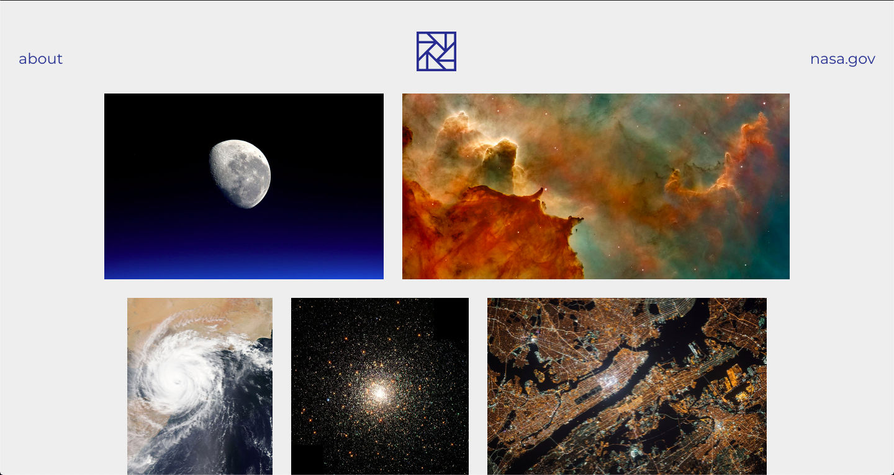
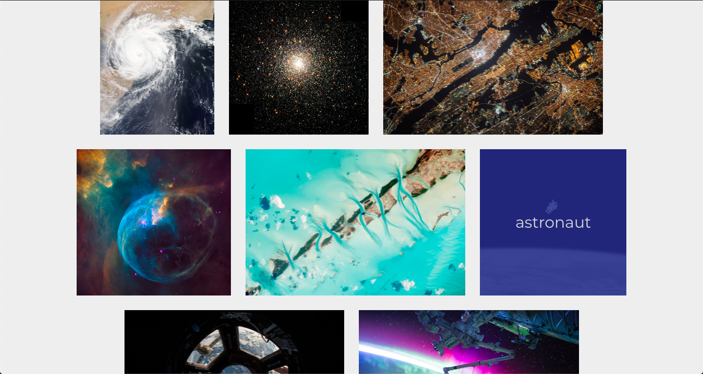

# Nasa
Portfolio site with flexbox layout.

## Table of contents
* [General info](#general-info)
* [Screenshots](#screenshots)
* [Technologies](#technologies)
* [Demo](#demo)
* [Features](#features)
* [Status](#status)
* [Inspiration](#inspiration)
* [Contact](#contact)

## General info
This was the fourth homework project on the [Superhi Foundation](https://superhi.com/courses/html-css-javascript-foundation) course. It is a redesign of the main project for the week, [Boyce](https://github.com/guybroadhurst/boyce). It introduced different forms of layout and positioning, including absolute and realative positioning. As well as introducing CSS flexbox and how to use it. The site has a couple of nice features involving hover overlays, transforming the images and adding the titles when you hover on a specific artwork. 

## Screenshots

## Technologies
* HTML5
* CSS3

## Demo
[Live Demo](https://guybroadhurst.github.io/nasa/)

## Features
List of features:
* Nice hover overlay with artwork title. 
* Flexible layout using CSS flexbox
* Alternative list layout view, with hover overlay of the artwork.

## Status
Project is: _finished_ and complete for the course.

## Inspiration
Designed by Nigel Payne, [Website](http://www.nigelpayne.com/) [Twitter](https://twitter.com/tweetsofpayne)
 
## Contact
Created by [@guybroadhurst](https://www.guybroadhurst.co.uk/) - feel free to contact me!
